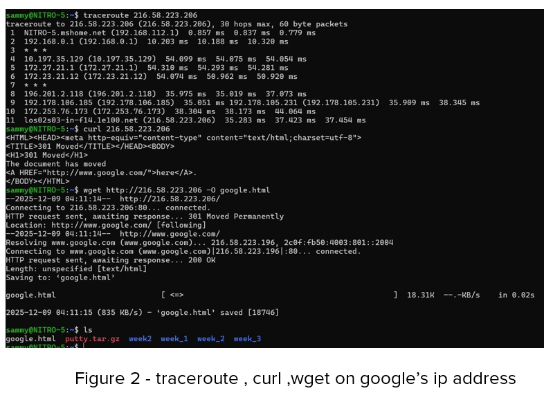

# DAY 1 – Networking Fundamentals

## Topics
- IP addresses  
- DNS  
- ping  
- traceroute  
- curl  
- wget  

An IP address is a unique identifier assigned to each device on a network. It is usually written in octets. The Domain Name System (DNS) translates human-friendly domain names, such as `google.com`, into machine-readable IP addresses.

Tools such as `ping` are used to check whether a server is reachable by measuring response time and packet loss. `traceroute` shows the path that data packets take from a local computer to a destination host. `curl` allows users to send requests to URLs and retrieve data, while `wget` is mainly used to download files or entire websites.

In this lab, I used `ping` to test connectivity to `google.com`. The packets were successfully transmitted and received, as shown in Figure 1.  

I then ran `traceroute` on `google.com`, which displayed the network path my data followed from my local machine to the destination, as shown in Figure 2.  

Finally, I used the `curl` command to fetch the Google homepage and saved the output to a file named `google.html`.
