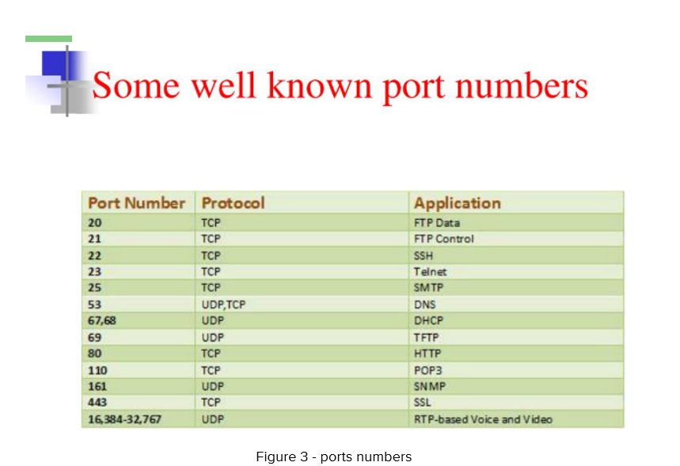
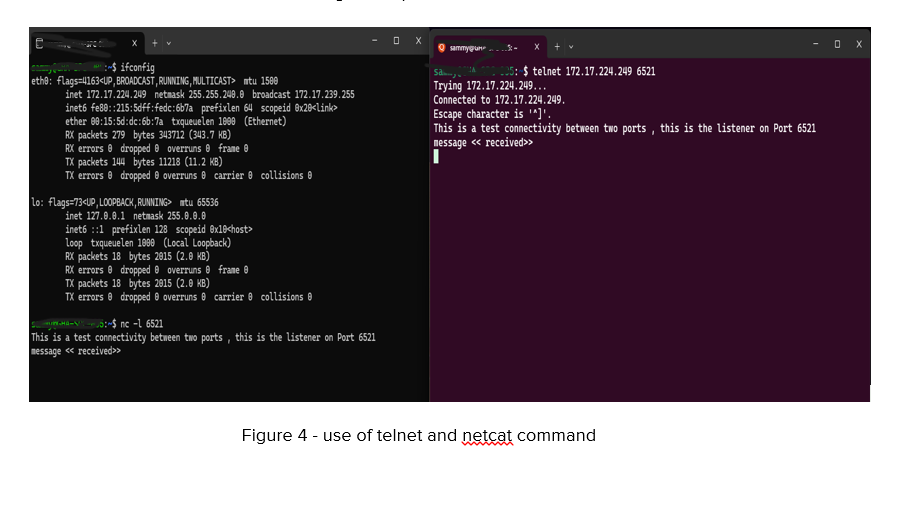
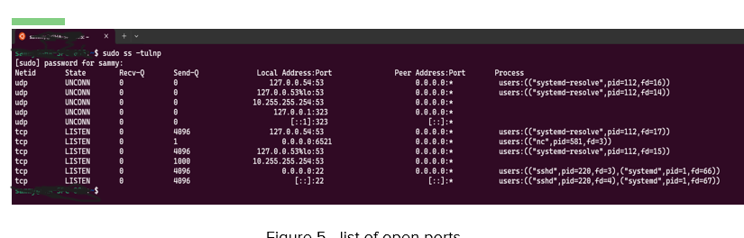

# DAY 2 – Network Tools & Service Diagnostics

**Topics:** netstat / ss, nc (netcat), telnet, checking open ports, simple debugging

Servers and ports are fundamental components of modern computing, playing a crucial role in how data is transmitted and received across networks. Ports are virtual gateways through which data enters and exits a server. Each port is assigned a unique number, allowing different types of data to be routed to the appropriate services within the server.

Figure 3 below shows some well-known ports.

Netcat’s core function is to allow two machines to connect and exchange data. I started a listener using `nc -l 6521`, which opened port 6521 on my machine. Then I used telnet to connect to the listener at IP address 172.17.224.249. TCP handled the connection between both sides. Telnet successfully reached the port, and the listener returned the message, confirming that communication worked correctly. This is shown in Figure 4 below.

To identify which service is running on an unknown open port, I used this command:

`sudo ss -tulnp`

From Figure 5, it can be seen that **Netcat (nc)** is using port 6521.

**Known open ports from Figure 5:**

- Port 22 (TCP): sshd (OpenSSH server)
- Port 53 (TCP & UDP): DNS
- Port 323 (UDP): chrony (time synchronization)

