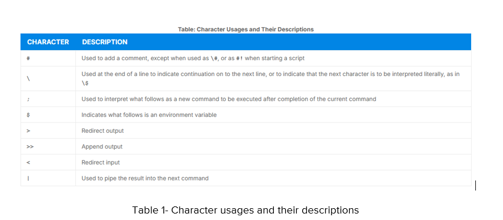
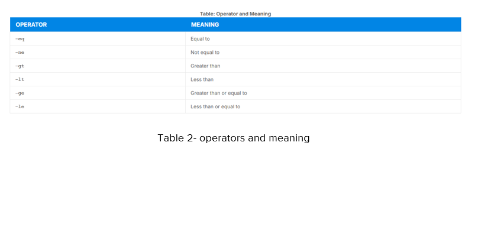
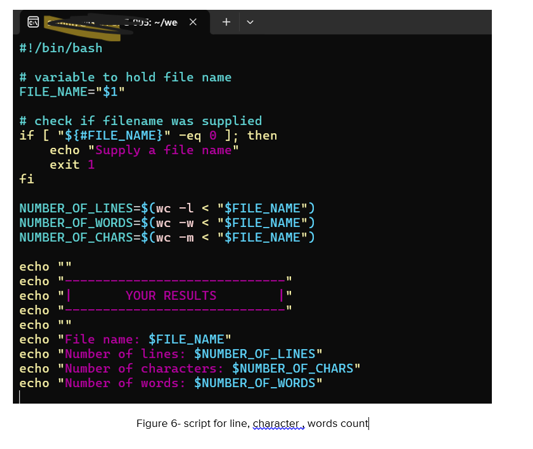
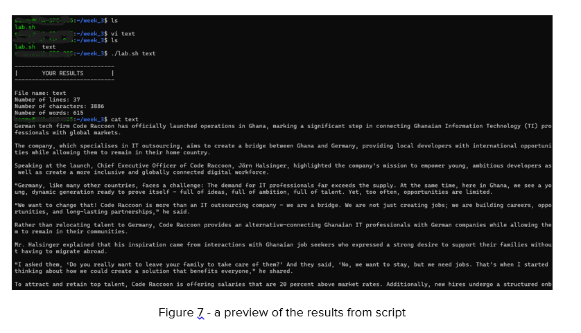
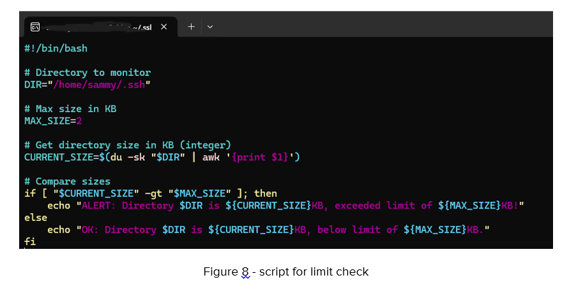
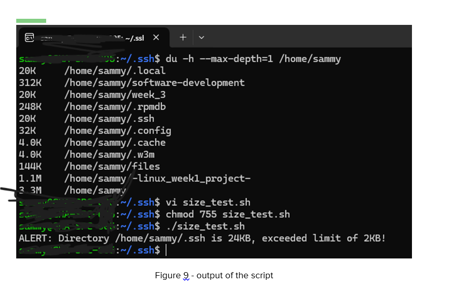

 # DAY 3 – Shell Scripting Basics

## Topics: 
Variables, conditionals (if/else), loops, functions, script execution (chmod +x)

Shell scripting is important in many ways. It combines the utility of the command line with the logical structures of programming, creating a bridge between system operations and automation. Variables in shell scripting are used to store data. Loops are also frequently used in Bash, with three common types being particularly important as shown below;
●	for -{for variable in list
do
    commands
done}
●	While - while [ condition ]
do
   commands to repeat
done }

Table 1 shows some of the character usages and their descriptions in Linux.

Table 2 also displays various operators that can be used in Linux.

I used the input redirection command and `wc` to count the number of words, characters, and lines, as shown in Figure 6.

For the challenge, I checked the sizes of various directories, specified the directory of interest, and compared their sizes. If the size of a directory exceeds the maximum limit I set in my script, an alert is generated as seen in Figure 9.

